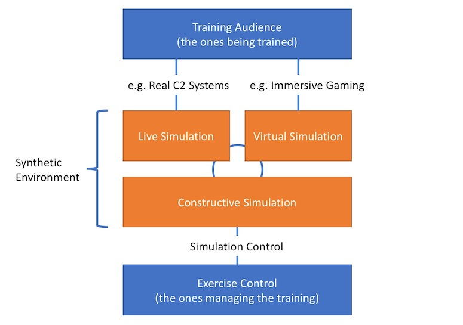

The use-case in this tutorial is a generic Staff Training Computer Assisted Exercise (CAX). This will help us develop a conceptual model and a federation design that will use NETN FAFD constructs to represent the synthetic environment.  

In Staff Training CAX the Trainees (Training Audience) exercise their staff processes and train on the procedures and tasks associated with their role in the organization. _Train as you fight_ - mean that the training audiende interactions should be so realistic that it feels like the real environment. Simulation is used to stimulate real systems with information or to provide simulations as interactive substitutes to real systems and environments. 

* Live simulation is when the training audience use real physical objects, systems or people to interact with the synthetic environment
* Virtual simulation is when the training audience interact with the synthetic environment using a virtual and visual representation of the environment
* Constructive simulation is used to model all objects, processes, events and actions occuring in the synthetic environment and that will stimulate live and virtual interfaces to the training audience.

### Conceptual Model

The basis for any federation design is a conceptual model describing what needs to be represented in the synthetic environment and the 
relationship between these concepts. 

Based on the conceptual model and the overall federation requirements, an allocation of modelling responsibilities is made as part of the federation design. The result is a clear understanding of the interfaces and information exchange required to model the synthetic environment and to maintain a representation of all relationships in a scenario based on the conceptual model.

The conceptual model we will use include aspects of combatant and non-combatant forces, platforms, sensors, weapons and other equipment. Processes and behaviour concepts such as orders, missions, tasks and reporting are also included as well as synthetic natural environment (SNE) aspects such as terrain, weather etc. The level of fidelity in the conceptual model is limited and the federation design is only one of many possible.

In short, we want to represent units on a battlefield moving around, detecting enemy forces using available sensors, engaging the enemy with weapons, consuming resources such as fuel and food, reporting to and taking orders from superiour units. A units ability to perform this will be affected by terrain, weather, availability and damage state of resources and equipment. 

### Allocation of Modelling Responsibilities

We have choosen a design that is sutiable for demonstrating the use of the NETN FAFD FOM modules and patterns of interplay.

