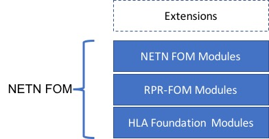

The NETN FOM is a defined set of HLA FOM Modules and is a combination of standard modules, modules defined as part of related standards and NETN specific modules.

In any NETN based HLA federation one or more of the NETN FOM modules can be used. Each FOM Module represent types of objects and events 
(interactions) that are used to exchange information between Federates (federated systems). Federates in an NETN federation publish and 
subscribe to the classes defined in the NETN FOM Modules and use HLA services to send and receive updates of class attributes and 
interaction parameters. Individual NETN FOM Modules can be extended and included as part of other FOMs.

The Following FOM Modules are identified as part of the NETN FOM

* RPR-FOM v2.0 FOM Modules
* NETN Base
* NETN Service Consumer/Provider Base
* NETN Physical
* NETN Aggregate
* NETN TMR
* NETN MRM
* NETN HCBML
* NETN LBML
* NETN CBRN
* NETN Storage
* NETN Repair
* NETN Transport
* NETN Supply
