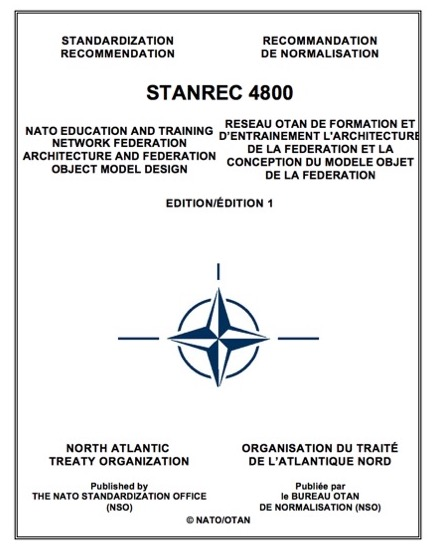
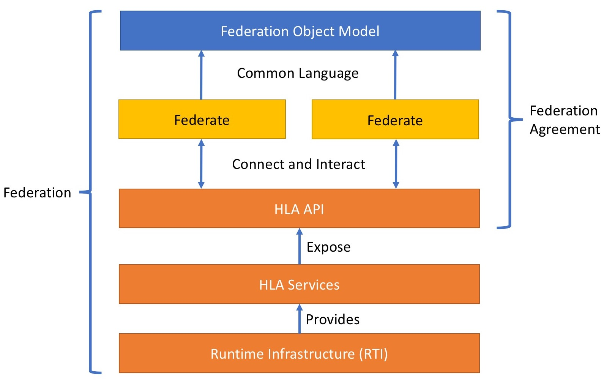
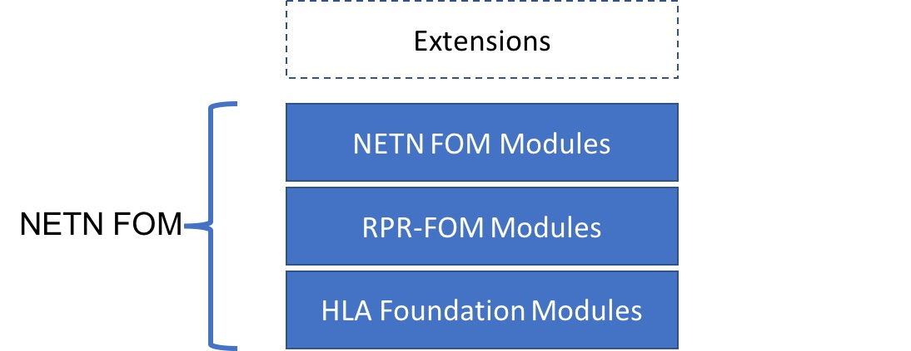

The NATO Education and Training Network (NETN) Federation Architecture and FOM Design (FAFD)
document is a reference document intended to provide architecture and design guidance for developing distributed simulation and training systems. 

NETN FAFD is maintained and published by NATO as an Allied Modelling and Simulation Publication (AMSP-04) and is covered by NATO STANREC 4800. The document and associated data files are publically available for download.

In this tutorial the focus is the use of the NETN FAFD when designing, implementing and executing distributed federated simulations using IEEE 1516 High-Level Architecture (HLA) as the core technical interoperability standard and with the NETN FAFD Federation Object Model (FOM) Modules as the information exchange object model. 

! NETN FAFD is based on the RPR-FOM v2.0 and any RPR-FOM based Federate is per definition NETN compliant. 
! But that definitely does not meen fully compliant as you will discover later in this documentation.

### Quick Intro to the Lingo

An HLA **Federation** is a loosely coupled simulation system of systems where the system elements (**Federates**) interact using communication services provided by an runtime infrastructure component (**RTI**) through open well defined and standardized services (**HLA**) and interfaces (HLA APIs). A **Federation Object Model (FOM)** specifies the type of data exchanged in the federation and is separate from the services used for sending the data making the RTI and HLA simulation domain agnostic. A **Federation Agreement** is a specification of federates' modelling responsibilities and how the HLA Services and a FOM should be applied to create a **Synthetic Environment** that is valid with respect to the overall purpose of the federation.

For details on HLA we recommend the following free [HLA Tutorial](http://www.pitchtechnologies.com/hlatutorial/).

### Federation Object Model 

The NETN FOM is a defined set of HLA FOM Modules and is a combination of standard modules, modules defined as part of related standards and NETN specific modules.

In any NETN based HLA federation one or more of the NETN FOM modules can be used. Each FOM Module represent types of objects and events (interactions) that are used to exchange information between Federates (federated systems). Federates in an NETN federation publish and subscribe to the classes defined in the NETN FOM and use HLA services to send and receive updates of object attributes and interaction parameters. Individual NETN FOM Modules can be extended and included as part of other FOMs.

The Following FOM Modules are defined as part of the NETN FOM

* RPR-FOM v2.0 FOM Modules
* NETN Base
* NETN Service Consumer/Provider Base
* NETN Physical
* NETN Aggregate
* NETN TMR
* NETN MRM
* NETN HCBML
* NETN LBML
* NETN CBRN
* NETN Storage
* NETN Repair
* NETN Transport
* NETN Supply
* NETN MSDL
* NETN Weather

### Federation Agreements

A Federation Agreement is a specification of how FOM Modules and HLA services should be used to support a distributed simulation. This tutorial specifies best practices and federation agreements for typical NETN FAFD based federations in support of Staff Training 
Computer Assisted Exercises (CAX). 