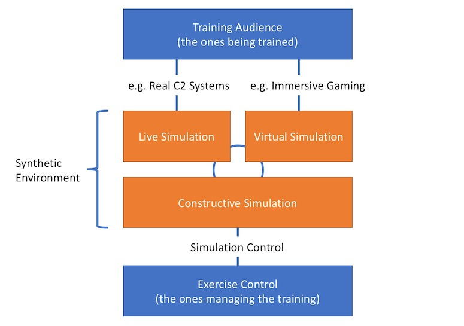

The use-case in this tutorial is a generic Staff Training Computer Assisted Exercise (CAX). This will help us develop a conceptual model and a federation design that will use NETN FAFD constructs to represent the synthetic environment.  

In Staff Training CAX the Trainees (Training Audience) exercise their staff processes and the procedures and tasks associated with their role in the organization. _Train as you fight_ - means that the training audience interactions with the training environment should be realistic enough to make it feel like the real world. 

Simulation is used to stimulate real systems with information or to provide simulations as interactive substitutes to real systems and environments. 

* Live simulation is when the training audience use real physical objects, systems or people to interact with the synthetic environment
* Virtual simulation is when the training audience interact with the synthetic environment using a virtual and visual representation of the environment
* Constructive simulation is used to model all objects, processes, events and actions occuring in the synthetic environment and that will stimulate live and virtual interfaces to the training audience. Although there is no direct interaction by the Training Audience, the Exercise Control staff may manipulate the synthetic environment through constructive simulation interfaces. 

! In the definition of Live simulation we include interaction with real-systems such as C2 system
! software configured for use in training. In the definition we also include interaction with 
! mockup environments, weapons for use in training and role-play performed by _Response Cell_ staff 
! acting as subordinates, superiors or any other role that require human interaction 
! with the training audience.

In this tutorial we will focus on distributed constructive simulation.