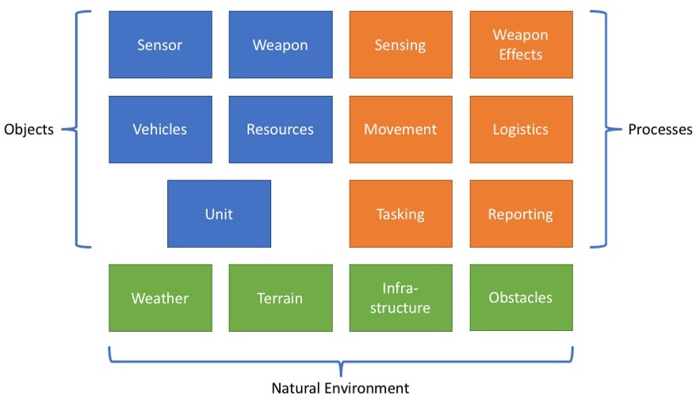

The basis for any federation design is a conceptual model describing what needs to be represented in the synthetic environment and the 
relationship between these concepts. 

Based on the conceptual model and the overall federation requirements, an allocation of modelling responsibilities is made as part of the federation design. The result is a clear understanding of the interfaces and information exchange required to model the synthetic environment and to maintain a representation of all relationships in a scenario based on the conceptual model.

The conceptual model we will use include aspects of combatant and non-combatant forces, platforms, sensors, weapons and other equipment. Processes and behaviour concepts such as orders, missions, tasks and reporting are also included as well as synthetic natural environment (SNE) aspects such as terrain, weather etc. The level of fidelity in the conceptual model for this tutorial is limited and the federation design we will use is only one of many possible.

In short, we want to represent units on a battlefield moving around, detecting enemy forces using available sensors, engaging the enemy with weapons, consuming resources such as fuel and food, reporting to and taking orders from superiour units. The abilities of a unit will be affected by terrain, weather, availability and damage state of resources and equipment. 

In each chapter of this tutorial we will introduce the relevant conceptual elements, their relationships and example allocation of modelling responsibilities to demonstrate how the NETN FAFD and NETN FOM is used to maintain the relationships during execution of a distributed simulation.
